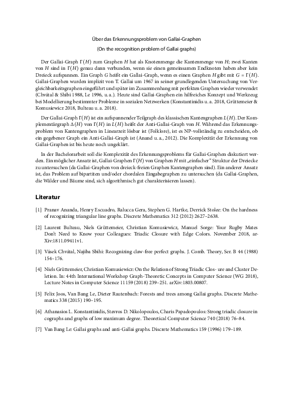
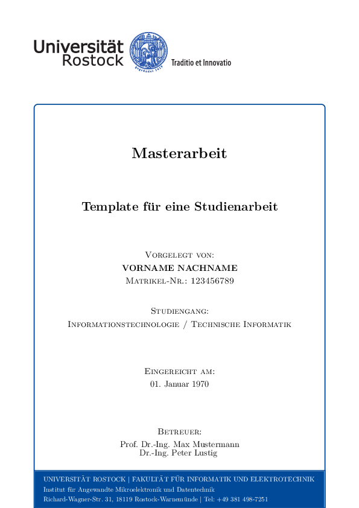
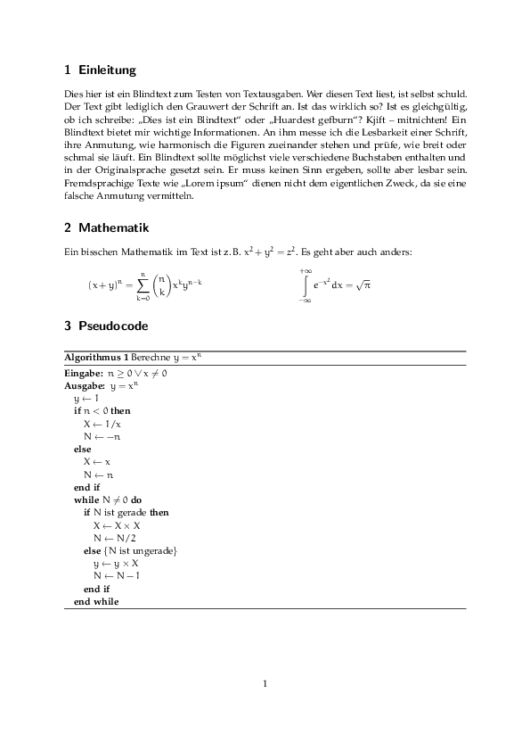
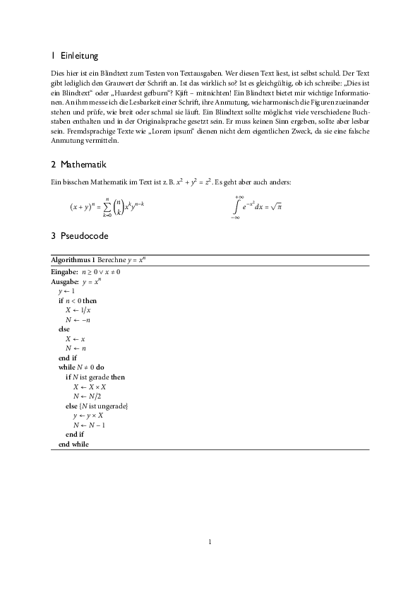
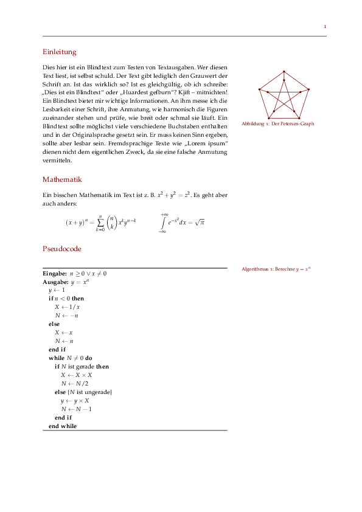

# FAQ zur Bachelorarbeit

### Ich soll jetzt eine Bachelorarbeit schreiben … wie fang ich damit an?

Welche Themen und Fächer haben dir in deinem Informatikstudium besser gefallen als andere? Welche Themen liegen dir? Welche Profs sind dir symphatisch und welche nicht? Von welchen Profs kannst was lernen?

Wenn du diese Fragen für dich beantwortet hast, dann suche dir einen Betreuer und besprecht gemeinsam mögliche Themen. Oft verläuft die erste Unterhaltung so:

> Du: Hallo, ich würde gerne bei Ihnen meine Bachelorarbeit schreiben. Was haben Sie für Themen im Angebot?  
> Prof: Kommt ganz darauf an, worüber du schreiben möchtest! Was interessiert dich denn?  
> Du: Öh, gute Frage …

Unsere Profs sind meist sehr entgegenkommend, also nutze das. Je mehr dich das Thema interessiert, desto besser hälst du die 20 Wochen durch.

Wenn ihr ein Thema ausgemacht habt, dann müsst ihr eine Themenbeschreibung formulieren. Diese enthält
* den Titel der Arbeit,
* eine kurze einleitende Beschreibung des Themas,
* ein paar Ansätze, die verfolgt werden sollen, und
* zu nutzende Literatur.

Hier ein Beispiel:

Diese Themenbeschreibung müsst ihr zusammen mit dem Formular [„Anmeldung Bachelorarbeit“](https://www.ief.uni-rostock.de/index.php?id=formulare) im Studienbüro einreichen, worauf sie vom Prüfungsausschuss abgesegnet wird. Ab dann geht’s los mit der Arbeit.

### Gibt’s irgendwo eine Vorlage, die ich nutzen kann/muss?

Es gibt eine [offizielle Vorlage](https://www.uni-rostock.de/universitaet/uni-gestern-und-heute/corporate-design/vorlagen/vorlagen-fuer-wiss-arbeiten/) für wissenschaftliche Arbeiten im Corporate Design. Über die Schönheit lässt sich streiten:  

Daher sprich das mit deinem Betreuer ab, ob er/sie auf diese Vorlage besteht. Meistens ist das nicht der Fall und solange das Design beim Lesen nicht stört, habt ihr gewissen Freiheiten. Vielleicht ist das genau der richtige Moment, um für sich selbst herauszufinden, was man schön findet. Hier ein paar Anregungen:

* Schriftart für Text: Palatino  
  Schriftart für Mathematik: Euler  
  Quelltext: `anregungen/palatino_euler.tex`  
  Ohne Probleme nutzbar.  
  
* Schriftart für Text: Minion Pro  
  Schriftart für Überschriften: Gill Sans  
  Schriftart für Mathematik: MnSymbol  
  Quelltext: `anregungen/minion_pro.tex`  
  Mittels [XeLaTeX](https://de.wikipedia.org/wiki/XeTeX) kann man die Schriftarten des Betriebssystems nutzen. Das ist besonders auf einem Mac interessant, weil dort viele hochqualitative Schriftarten vorhanden sind (z.B. die richtige Helvetica). Für diese Anregung muss man sich selbst auf die Suche nach der Minion Pro machen.  
  
* Wer mal was richtig edles ausprobieren möchte, der schaue sich [Tufte-LaTeX](https://tufte-latex.github.io/tufte-latex/) bzw. eine [aktuelle Version](https://github.com/cbettinger/tufte-lovecraft-latex) an (siehe auch [den Wikipedia-Eintrag zu Edward Tufte](https://de.wikipedia.org/wiki/Edward_Tufte)).  
  Quelltext: `anregungen/tufte.tex`  
  

### Sonstige Tipps?
* Nutze ein Programm zur Literaturverwaltung. [Zotero](https://www.zotero.org) ist ziemlich nice.
* Fang ruhig in der Mitte an beim Schreiben, wenn du nicht weißt wie du anfangen sollst. Früh anfangen und oft redigieren.
* Nimm dir einen Tag für das Deckblatt, die eidesstattliche Erklärung und das ganze Gebimmel. Am besten einen Tag, an dem du keine Lust auf inhaltliche Arbeit hast. Dann ist das erledigt und du musst es nicht kurz vor der Abgabe machen. Das dauert nämlich immer länger als dir lieb ist.
