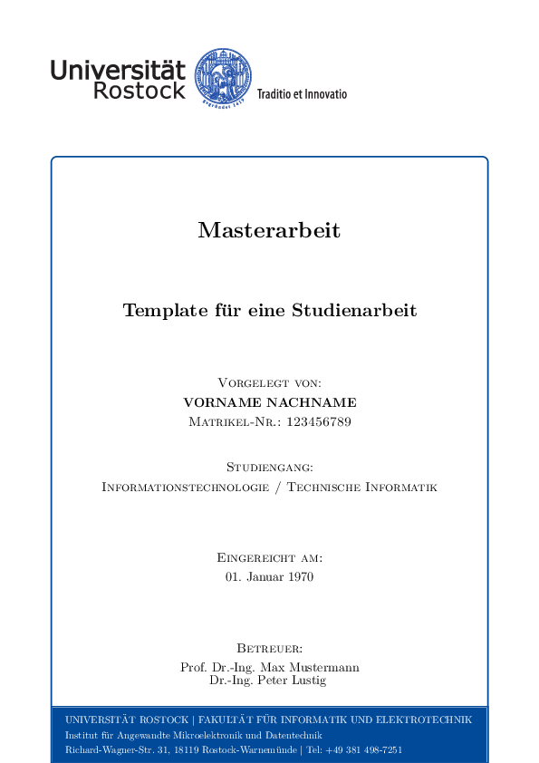

# FAQ zur Bachelorarbeit

### Gibt’s irgendwo eine Vorlage, die ich nutzen kann/muss?

Es gibt eine [offizielle Vorlage](https://www.uni-rostock.de/universitaet/uni-gestern-und-heute/corporate-design/vorlagen/vorlagen-fuer-wiss-arbeiten/)
für wissenschaftliche Arbeiten im Corporate Design. Über die Schönheit lässt
sich streiten:

